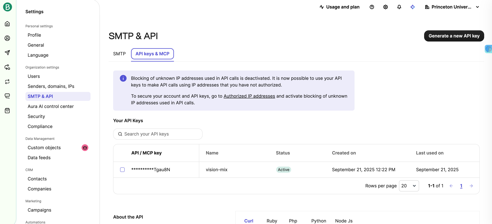

# Get Started

This is the doc for you to understand the basics about TPUs and create your first job with jobman! 

## Table of Contents

- [TPU Basics](#tpu-basics)
- [Configuration](#configuration)
  - [job](#job)
  - [tpu](#tpu)
  - [gcsfuse](#gcsfuse)
  - [ssh](#ssh)
  - [docker](#docker)
  - [conda](#conda)
  - [venv](#venv)
  - [command](#command)
- [Minimal Checklist Before You Run](#minimal-checklist-before-you-run)
- [Commands Mannual](#commands-mannual)
  - [Basic Commands](#basic-commands)
  - [Debugging Commands](#debugging-commands)

## TPU Basics
Before start working with Jobman, let's go through some basics concepts in TPU (if you're already familiar with TPUs, go to the next section):
- TPU (Tensor Processing Unit): Google’s hardware for fast machine learning (like a GPU, but optimized for deep learning).
- TPU VM: The machine you log into to run code directly on TPUs.
- TPU Pod: A cluster of many TPUs connected together for large-scale training.
- Host: The CPU machine that manages a TPU (in a pod, there are multiple hosts).
- External IP: Used to log in (SSH) from your computer.
- Internal IP: Used for TPUs to talk to each other inside a pod.
- Bucket: Google Cloud Storage (GCS) where you put datasets, logs, and checkpoints. Note you only have 100G disk space on each TPU VM (host), so it's necessary to store your large files in a bucket first, then access it by mounting to your VM or by using [gsutil](https://cloud.google.com/storage/docs/gsutil).
- SSH Key: Needed to securely connect to TPU hosts (and to let them connect to each other in multi-host jobs).
- Region: A large geographic area (e.g., us-central1, europe-west4) that contains Google Cloud resources. **Buckets are tied to a specific region, meaning data is physically stored there**.
- Zone: A smaller location within a region (e.g., us-central1-b). **TPUs are created in zones**.

```
                ┌──────────────────────────────────────────────┐
                │                 REGION                       │
                │              (e.g., us-central1)             │
                │                                              │
                │  ┌────────────────┐     ┌─────────────────┐  │
GCS Bucket ───▶ │  │  GCS BUCKET    │     │     ZONE A      │  │
 (lives at      │  │ (llm_pruning_  │     │ (us-central1-a) │  │
 region level)  │  │  us_central1)  │     │  ┌──────────┐   │  │
                │  └────────────────┘     │  │ TPU VM 1 │   │  │
                │                         │  └──────────┘   │  │
                │                         │  ┌──────────┐   │  │
                │                         │  │ TPU VM 2 │   │  │
                │                         │  └──────────┘   │  │
                │                         └─────────────────┘  │
                │                                              │
                │                         ┌─────────────────┐  │
                │                         │     ZONE B      │  │
                │                         │ (us-central1-b) │  │
                │                         │  ┌──────────┐   │  │
                │                         │  │ TPU VM 3 │   │  │
                │                         │  └──────────┘   │  │
                │                         └─────────────────┘  │
                └──────────────────────────────────────────────┘
```

<!-- ```mermaid
flowchart TB
  subgraph REG[REGION: us-central1]
    B[(GCS Bucket)]
    subgraph ZA[ZONE: us-central1-a]
      A1[TPU VM 1]
      A2[TPU VM 2]
    end
    subgraph ZB[ZONE: us-central1-b]
      B1[TPU VM 3]
    end
  end

  %% Data/access paths
  B --- A1
  B --- A2
  B -.cross-zone ok but stay in region.-> B1

  %% Annotations
  classDef good fill:#eaffea,stroke:#2ca02c,color:#2c3e50;
  classDef warn fill:#fff6e5,stroke:#ff9900,color:#2c3e50;

  class A1,A2,B good
  class B1 warn
``` -->

## Configuration

# Jobman Configuration Guide

This guide explains each part of the configuration file and how to customize it for your own TPU jobs. You may build upon [configs/template.yaml](configs/template.yaml) to create your own config.

---

### `job`
Defines global job behavior.

- **`name`**: A human-readable label for the run. Shows up in dashboards/logs.  
  *Tip:* Encode model, scale, and purpose (e.g., `pretrain-llama3-8b-200b-tune`).
- **`env_type`**: Runtime environment. `docker` means all work happens inside a container. You may also choose `conda` or `venv`.
- **`loop`**: If `true`, the job restarts automatically on exit (useful for spot/preemptible TPUs or iterative jobs).
- **`remote_user`**: User name you use on the remote machine.

e.g.
```yml
job:
  name: pretrain-llama3-8b-200b-tune
  env_type: docker # docker | conda | venv
  loop: true
  remote_user: zephyr
```
---

### `tpu`
Requests and configures TPU resources.

- **`allocation_mode`**:  
  - `tpu-vm`: direct, legacy style allocation.  
  - `queued-resources`: recommended; queues the request until capacity is available.
- **`accelerator`**: TPU type/size (e.g., `v4-8`, `v4-32`, `v4-128`). Pick based on model/global batch and budget.
- **`name`**: TPU resource name. Interpolates variables (e.g., `yufeng-${tpu.accelerator}`) so names stay descriptive.
- **`zone`**: Compute *zone* (e.g., `us-central2-b`).  
  *Rule of thumb:* Keep your **bucket** in the same **region** (here: `us-central2`) to reduce latency and egress costs.
- **`version`**: Base TPU VM image (e.g., `tpu-ubuntu2204-base`).
- **`pricing`**:  
  - `spot`: cheapest; can be evicted.  
  - `ondemand`: standard pricing.  
  - `preemptible`: legacy term on some platforms; similar to spot.
- **`flags`**: Additional flags you want to use when requesting the TPU resource.

e.g
```yml
tpu:
  allocation_mode: "queued-resources"    # tpu-vm | queued-resources
  accelerator: v4-128
  name: yufeng-${tpu.accelerator}
  zone: us-central2-b
  version: tpu-ubuntu2204-base
  pricing: spot
  # spot | ondemand | preemptible
  flags: null
```

Side Note: my personal experience with using different types of TPUs.  
In my use cases, I train 2B-8B large language models with 64-256 TPU cores. You may refer to the speed comparison profiled by Taiming Lu and me:
| Device | Tokens/s | Tokens/h | Tokens/day | Comparison |
|:--:|:--:|:--:|:--:|:--:|
| L40 | 1,146 | 4.1M | 0.10B | 45\% |
| A100 | 2,570 | 9.3M | 0.22B | 100\% |
| H100 | 3,855 | 13M | 0.33B | 150\% |
| v4-1 | 1,079 | 3.9M | 0.09B | 42\% |
| v5e-1(estimated) | 1,203 | 4.3M | 0.10B | 46\% |
| v6e-1 | 3,627 | 13M | 0.31B | 141\% |

Undoubtedly v6e TPUs are the strongest TPUs, but in our experience v6e tpus (v6e-{32,64,...})have very long queue time and are usually preempted in the blink of an eye. Therefore, v4 and v5e are more recommended for stable experiments.   
For more information, see [Boya's doc](https://github.com/boyazeng/tpu_intro/blob/main/TPU.md).

---

### `gcsfuse`
Mounts a GCS bucket into the VM filesystem.

- **`bucket_name`**: Your GCS bucket (e.g., `llm_pruning_us_central2_b`).  
  *Note:* Bucket lives at **region** scope; choose same region as the TPU’s zone’s region.
- **`mount_path`**: Local path where the bucket will appear (e.g., `/home/zephyr/gcs-bucket`).  
  *Use cases:* datasets, checkpoints, scripts.

e.g.
```yml
gcsfuse:
  bucket_name: llm_pruning_us_central2_b
  mount_path: /home/zephyr/gcs-bucket
```
---

### `ssh`
Prepares SSH keys and host configs on the TPU VM(s).

- **`private_key`**: Default SSH private key you use to connect to the VM from local machine (e.g., `~/.ssh/id_rsa`). **This is optional** since you can log into the gcloud, a key will be automatically generated and saved at `~/.config/gcloud/credentials.db`.
- **`identities`**: Additional identities and inline `ssh_config` snippets.
  - `config_entry` blocks let you preconfigure hosts (e.g., `Host 10.*` for intra-pod SSH, `Host github.com` for git).
  - Ensures multi-host jobs can SSH among nodes; also avoids manual `ssh-add`.
  - identities is also optional.

IMPORTANT: all `private_key` and `public_key` are local paths on your local machine. They will be scp'ed to the TPU VM and named as `~/.ssh/<file_name>`. Therefore in the `config_entry` you should write the remote_path instead.

e.g.
```yml
ssh:
  private_key: ~/.ssh/id_rsa
  identities:
    - private_key: ~/.ssh/id_rsa
      public_key: ~/.ssh/id_rsa.pub
      config_entry: | 
        Host 10.* 34.* 35.*
          IdentityFile ~/.ssh/id_rsa
          IdentitiesOnly yes
    - private_key: ~/.ssh/id_ed25519_github
      public_key: ~/.ssh/id_ed25519_github.pub
      config_entry: |
        Host github.com
          User git
          IdentityFile ~/.ssh/id_ed25519_github
          IdentitiesOnly yes
```
---

### `docker`
Container runtime settings for reproducible environments.

- **`image`**: Docker image to run (e.g., `yx3038/maxtext_base_image:latest`). Pin versions for reproducibility.
- **`env_vars`**: 
- **`flags`**: Extra `docker run` flags.  
  - `-u <user_id>`: Specify user id, permission, and ownership inside of the container.
  - `-v <volume>`: Host paths mounted inside the container.
  - `-w <work_dir>`: Default working directory inside the container.
  - `--env <env_var>`: Environment variables injected into the container.
  - `--network=host`: shares host network (useful for TPU comms, faster GCS access).
  - `--privileged`: grants extended privileges (needed for some low-level ops).  

e.g.
```yml
docker:
  image: yx3038/maxtext_base_image:latest
  flags: 
    - "--privileged"
    - "--network=host"
    - "--env HOME=/home/zephyr"
    - "-v /home/zephyr:/home/zephyr"
    - "-v /dev:/dev"
    - "-v /run:/run"
    - "-v /home/zephyr/.config/gcloud:/root/.config/gcloud"
    - "-w /home/zephyr"
```

---

### `conda`
(Optional) Create/use a Conda env inside the container.

- **`name`**: Conda env name (e.g., `maxtext-conda`). Will be saved at `~/<name>`.
- **`config_file`**: Path to an `maxtext-env.yaml` with Conda deps.  
  *Tip:* Use either Conda *or* venv—keeping both increases maintenance.

e.g.
```yml
conda:
  name: maxtext-conda
  config_file: assets/maxtext-env.yaml
```

---

### `venv`
(Optional) Create/use a Python virtualenv inside the container.

- **`name`**: Venv name (e.g., `maxtext-venv`). Will be saved at `~/<name>`.
- **`requirements_file`**: `pip` requirements file path.
- **`python`**: Python version for the venv (e.g., `"3.10"` or `"python3.10"`).  

e.g.
```yml
venv:
  name: maxtext-venv
  requirements_file: assets/requirements.txt  
  python: "python3.10" 
```
---

### `command`
The actual workload to run on the TPU VM (inside the container).

- **`cmd`**: A shell script block that orchestrates your run.
- **`workers`**: Which hosts run the command.  
  - `[0]`: only the first host (controller).  
  - `"all"`: run on all hosts (for symmetric multi-host jobs).  
  - `[0,1,...]`: explicit list if needed.

e.g.
```yml
command:
  cmd: |
    pip show flax
    pip show jax
  workers: [0] # int | list | "all"
```
---

## Commands Mannual
Below are the most common cli commands you may find useful in jobman.

### Basic Commands
| Purpose | Command |
|:--:|:--:|
| Create a new job | `jobman create <config_path>` |
| Check all jobs status | `jobman list` |
| Resume an existing job | `jobman resume <job_id>` |
| Kill the backend process for a job | `jobman cancel <job_id>` |
| Kill process and delete TPU resources | `jobman delete <job_id>` |
| Kill, delete, and clean logs | `jobman clean <job_id>` |

### Debugging Commands
| Purpose | Command |
|:--:|:--:|
| ssh to host0 for job id | `jobman ssh <job_id>` |
| stop your job and restart | `jobman reboot <job_id>` |
<!-- | Request TPU for job id | `jobman tpu <job_id>` |
| Set up ssh for job id | `jobman ssh <job_id>` |
| Set up gcsfuse for job id | `jobman gcsfuse <job_id>` |
| Set up docker for job id | `jobman docker <job_id>` |
| Set up conda for job id | `jobman conda <job_id>` |
| Set up venv for job id | `jobman venv <job_id>` |
| Run command only for job id | `jobman run <job_id> --cmd-only` | -->

### Profiling Commands
| Purpose | Command |
|:--:|:--:|
| List sizes of buckets | `jobman storage` |
| List cores and ips quotas | `jobman quota` |
<!-- | List daily billings | `jobman billing` | -->

## Email Notification
This is an advanced function in JobMan, and you need to configure brevo, a free email sending api by yourself. Specifically, you need to do 3 things:
1. sign up for Brevo
2. get a Brevo API key like the following:

3. add brevo entries to your config:
```yaml
brevo_email:
  api_key: <your api key>
  sender: <the email address you used to sign up for brevo>
  receiver: <the email address you want to notify>
```
Note that the free limit of brevo is **300 emails per day**. Try not to blow up that limit.
