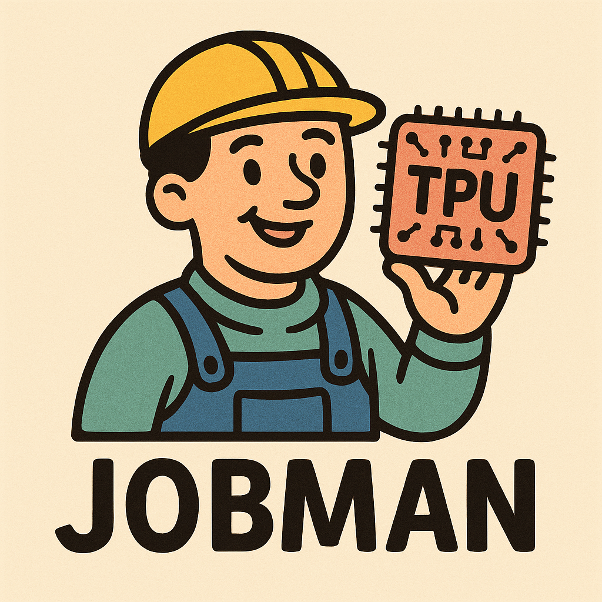

<h1 align="center">Jobman-v2</h1>

<p align="center">
  
</p>

Jobman-v2 is a modular and extensible job management system for TPU VMs. 

## News

- **2025-09-21**: Now you can configure to make jobman send you emails when tpu resources are allocated. See [here](https://github.com/Zephyr271828/jobman/blob/jobman-exp/GET_STARTED.md#email-notification) and [here](jobman/utils.py) for details.
- **2025-09-08**: I discovered [tpu-pod-commander](https://github.com/young-geng/tpu_pod_commander) by Young Geng at Deepmind, which has very similar functions as Jobman but is much simpler in design. Jobman aims to settle down everything for the user but can be hard to understand or debug, whereas tpu-pod-commander is much more native to the generic TPU interfaces. Feel free to switch to tpu-pod-commander if you prefer its design.
- **2025-09-06**: Added an [automatic checker](https://github.com/Zephyr271828/jobman/blob/jobman-exp/jobman/jobman.py#L76) to verify the bucket region and the TPU VM zone match, so that you can ensure your storage costs are minimized.
- **2025-08-28**: Added support for conda and venv as well as [unit tests](tests).
- **2025-08-22**: Added quota and storage [viewer](https://github.com/Zephyr271828/jobman/blob/jobman-exp/GET_STARTED.md#profiling-commands).

## Installation

In order to use Jobman, you need to make sure `gcloud` is available on your machine in the first place. You may refer to [the official doc](https://cloud.google.com/sdk/docs/install) to do so.  
Afterwards, also install `alpha` and `beta`:
```bash
gcloud components install alpha beta
```

Login with your gcloud account:
```bash
gcloud auth login
gcloud auth application-default login
```

Also make sure tmux has been installed:
```bash
tmux -V
```
If not, follow [tmux wiki](https://github.com/tmux/tmux/wiki/Installing) to install tmux.

Lastly, build the jobman package from source:
```bash
python -m pip install --upgrade pip
pip install -e .
```

### TLDR?
Try the following command to submit a minimal job:
```
jobman create configs/quick_start.yaml
```
Then check its status
```
jobman list
```

## Get Started 
Before you start using Jobman (properly), be sure to go through [GET_STARTED.md](GET_STARTED.md). This is vital for you to proceed to run your own jobs.

## Overall Structure
This section differs from the Get Started section as it explains briefly how Jobman works. Basically, each job is viewed as a data structure or a class by Jobman, with
- life cycle, including queueing, running, idle, and dead managed by a centralized data structure `jobman`. Specifically, `jobman` creates and kills tmux sessions to manage the jobs in the backend.
- corresponding tpus, ssh, gcsfuse, and environment config as attributes.
- all logs saved to `jobs/<user_id>/<job_id>/logs`.

### Caveats
- since jobs live as tmux sessions, it's suggested that you run this tool on some remote host instead of some local machine, since tmux sessions may die after you shut down your machine.
- on the other hand, `jobman` lives as several local data files inside of `jobs/.jobman` and uses a lock to maintain the consistency. Therefore, please do not mess up with the files in `jobs/.jobman` unless you know what you're doing (if you cannot find `jobs/.jobman`, it's normal since it'll be created after you run your first job).

## Other Resources

### TPU Intro
Boya Zeng has created [a comprehensive guide](https://github.com/boyazeng/tpu_intro) covering various problems and tips when using tpus. You can find the answers to most of the problems you may have regarding TPUs. This project also provides [a simple job management script](https://github.com/boyazeng/tpu_intro/tree/main/job_management).

### Ultra Create TPU
The design concept of Jobman is somewhat complex, but it aims to provide the easiest user interface s.t. users unfamiliar with TPUs can quickly get started.  
For a simpler setup tool, you may refer to [`other_resources/ultra_create_tpu.sh`](other_resources/ultra_create_tpu.sh) by Peter Tong.

### Slack Chatbot
Boyang Zheng has also developed a brilliant Slack Chatbot that 1) automatically deletes dead tpu vms 2) profiles daily usage and sends to their Slack Channel. You may refer to it at [`other_resources/slack_chatbot`](other_resources/slack_chatbot).

## Dashboard
Coming soon

## FAQ
1. **Q:** I ran `jobman create <config_path>` but nothing happens. What should I do?  
**A:** Under the hood, `jobman create` creates the job directory and starts the job process with tmux in the backend. If the job process fails, it fails silently since it's in tmux.  
The first debugging step is to run `jobman run <job_id>` where `<job_id>` is the id of the job you just created. This will run the job in the front end. If this stucks as well, please kindly check if `gcloud` command works on your machine.
2. **Q:** How can I validate the job status displayed in `jobman list`?  
**A:** Although in my use cases, the 4 jobs states (QUEUEING, RUNNING, IDLE, DEAD) are mostly accurate, it'a always a good idea to verify the TPU state on Google Cloud Console. If you observe inconsistencies between `jobman list` and Google Cloud Console, kindly open an issue and report the bug.

## Contributions & Feedback
- If you have any issues with this project or want to contribute to it, please first open an issue in the `Issues` section. This will be of great help to the maintenance of this project! 
- You may also contact Yufeng Xu [yx3038@nyu.edu](mailto:yx3038@nyu.edu) for further communication.
- Also, if you would like to contribute to this project, please refer to [CONTRIBUTING.md](CONTRIBUTING.md).

